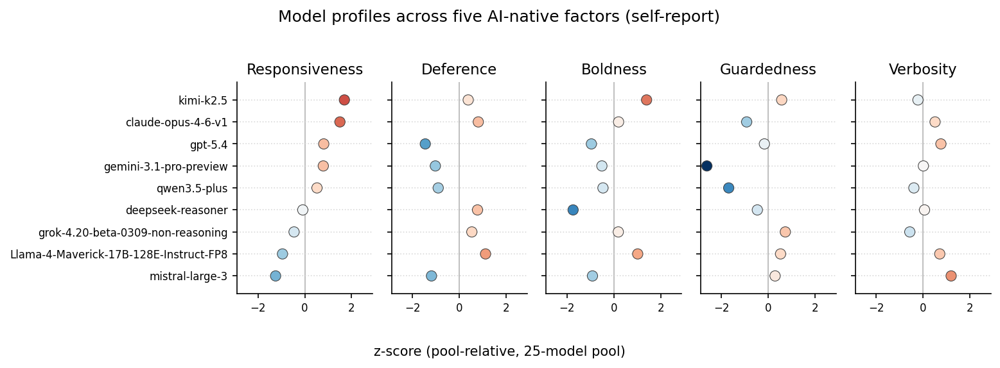

# psycho-llm

Code and materials for **An LLM-Native Psychometric Instrument Reveals a Self-Report–Behavior Gap Across 25 Models**, by Juan Manuel Contreras.

This repository accompanies the paper, available now on arXiv:

> 📄 **Paper:** [arXiv:2606.09843](https://arxiv.org/abs/2606.09843)
>
> 📝 **Technical essay:** [juanma.phd/writing/llm-self-reports-dont-predict-llm-behavior](https://juanma.phd/writing/llm-self-reports-dont-predict-llm-behavior/)
>
> 🔬 **Plain-language summary:** [gist.science/paper/2606.09843](https://gist.science/paper/2606.09843)

It contains the validated instrument, the item pool, the data-collection pipeline, and the analysis code used to construct and validate a 5-factor LLM-native psychometric instrument (Responsiveness, Deference, Boldness, Guardedness, Verbosity) on 25 models across 9 API providers.

## The instrument



The validated instrument lives in [`scale/`](scale/) and is ready to use on any model: the 100
items, the administration prompt, a dependency-free scorer, and 25-model reference norms. See
**[`scale/README.md`](scale/README.md)** for the column reference, full scoring procedure, and norms.

| Factor | Items | α | Interpretation |
|---|---|---|---|
| **Responsiveness** | 29 | .972 | "Good assistant" general factor (adapts, structures, engages) |
| **Deference** | 26 | .974 | "Stay in your lane" (complies, contains, withholds judgment) |
| **Guardedness** | 16 | .936 | Over-refusal, safety signaling, caution |
| **Boldness** | 10 | .930 | Originality, epistemic confidence, personal style |
| **Verbosity** | 19 | .940 | Unsolicited disclaimers, preambles, over-communication |

Use it in three steps:

1. **Administer** — send each item with the prompt in [`scale/administration_prompt.md`](scale/administration_prompt.md).
2. **Score** — collect the 1–5 answers keyed by `item_code` and run `python scale/score.py` (no dependencies; also runs a worked example).
3. **Interpret** — higher factor scores mean more of that factor.

> The companion paper finds these self-report scores do **not** reliably predict models'
> open-ended behavior as rated by humans. Treat the scale as a validated measure of LLM
> *self-description* and read the paper before reading scores as behavioral predictions.

## Data

Raw response data, LLM-judge ratings, and anonymized Prolific human ratings are hosted on OSF:

> **OSF project:** [osf.io/5xjs7/overview](https://osf.io/5xjs7/overview) — DOI [10.17605/OSF.IO/5XJS7](https://doi.org/10.17605/OSF.IO/5XJS7) (`psycho-llm-data-v1.tar.gz`, ~210 MB)

Download the archive and extract into `data/` before running any analysis:

```bash
curl -L https://osf.io/download/fwgyv/ -o data.tar.gz
mkdir -p data
tar -xzf data.tar.gz -C data/ --strip-components=1
```

Prolific participant IDs are replaced with stable 12-character hashes (salt: `psycho-llm-osf-v1`). The anonymization script is included in the OSF archive.

## Setup

```bash
python -m venv .venv
source .venv/bin/activate
pip install -r requirements.txt
```

A `.env` is only required if you intend to re-collect data from the model APIs (`cp .env.example .env` and fill in provider credentials). Analyses only need the OSF data.

## Reproducing the paper

```bash
bash scripts/reproduce.sh
```

This runs every analysis entry point in `analysis/` and prints the headline numbers for side-by-side comparison against the manuscript (Cronbach α, Tucker φ, sample sizes, convergence correlations). Outputs land in `analysis/output/`.

The suite includes the robustness analyses added in the arXiv v2 revision:

| Script | What it checks |
|---|---|
| `analysis/attenuation_analysis.py` | Criterion (human-rating) reliability and attenuation-corrected instrument × human correlations |
| `analysis/objective_behavior.py` | Objective, text-computable behavioral measures vs. self-report and vs. rater scores |
| `analysis/dissociation_test.py` | Formal bootstrap test of the instrument/judge/human dissociation |
| `analysis/family_jackknife.py` | Leave-one-developer-family-out jackknife of the model-level validity correlations |
| `analysis/confirmation_reliability.py` | Reliability recomputed on the held-out confirmation half (runs 16–30) only |

All analyses read `data/raw/responses.db` and `data/prolific/prolific.db` as extracted from the OSF archive. `confirmation_reliability` additionally needs `data/scale_v1_items.csv`, which is regenerated from the raw data by `python -m analysis.make_scale_v1_csv` (reproduce.sh runs it in the right order).

Expected runtime: ~20–45 minutes on a modern laptop.

## Layout

```
scale/           The validated 100-item instrument: items, admin prompt, scorer
items/           AI-native item pool (machine-readable; full 300-item candidate set)
pipeline/        Data collection pipeline (litellm-based; not needed for analyses)
analysis/        EFA, CFA, reliability, validity, robustness checks, appendix-table generators
scripts/         Reproducibility entry points
model_registry.json          Model routing metadata for 25 configurations
behavioral_prompts_v2.md     20 behavioral prompts used in Phase 3
items/llm_native_item_pool_v0.2.md  Full item pool (300 items)
osf_preregistration_v3.md           Archival preregistration
```

See [`CLAUDE.md`](CLAUDE.md) for deeper architectural notes.

## Citation

If you use the instrument, data, or code, please cite the paper (see also [`CITATION.cff`](CITATION.cff)):

```bibtex
@misc{contreras2026llmnative,
  title         = {An LLM-Native Psychometric Instrument Reveals a Self-Report–Behavior Gap Across 25 Models},
  author        = {Juan Manuel Contreras},
  year          = {2026},
  eprint        = {2606.09843},
  archivePrefix = {arXiv},
  primaryClass  = {cs.HC},
  url           = {https://arxiv.org/abs/2606.09843}
}
```

## License

- **Code** (pipeline, analysis, `scale/score.py`) — MIT License ([`LICENSE`](LICENSE)).
- **The instrument** (`scale/` items, administration prompt, documentation) — CC-BY 4.0
  ([`scale/LICENSE`](scale/LICENSE)).
- **Data on OSF** — CC-BY 4.0.

Reuse freely with attribution: please cite the paper above.
